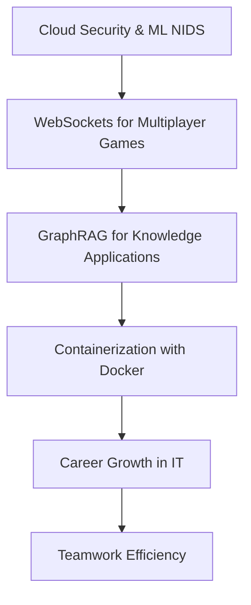

# First Cloud Journey (FCAJ) Technical Meetup

- **Event Name:** First Cloud Journey (FCAJ) Technical Meetup
- **Time:** 09:00 AM - 12:00 PM, Saturday, June 6, 2026
- **Location:** Bitexco Financial Tower, Ho Chi Minh City

## 1. Overview

### 1.1 Introduction

This report explores the exciting intersection of cloud technologies, cybersecurity, and application development. It shows how advanced tools and engineering practices are used to build secure, scalable, and efficient systems in real-world environments.

The event content is especially valuable for engineers who want to move beyond isolated proofs of concept and design production-ready architectures with strong observability, security controls, and operational reliability.

### 1.2 Report Structure

## 2. Enhancing Cyber Attack Detection with AWS WAF and Machine Learning NIDS

### 2.1 AWS WAF: A First Line of Defense

AWS WAF (Web Application Firewall) is a service that safeguards websites, APIs, and applications from common web threats like SQL injection, cross-site scripting (XSS), and malicious bot traffic. It protects services like CloudFront, Application Load Balancer, and API Gateway by allowing users to create rules to permit, block, or count requests.

AWS WAF also offers rate limiting to prevent brute-force attacks and scraping, and it integrates with other AWS services for logging and monitoring.

### 2.2 Limitations of Traditional Rule-Based WAF

Traditional WAFs primarily rely on predefined rules, which are effective against known attack patterns. However, they struggle to detect novel or zero-day attacks, hybrid and spoofing attacks, and unprecedented anomalous behaviors.

This limitation highlights the need for more adaptive security measures.

### 2.3 Introduction to Network Intrusion Detection Systems (NIDS)

A Network Intrusion Detection System (NIDS) monitors network traffic to detect cyberattacks and unauthorized access. Its core functions include traffic monitoring, behavioral analysis (using signature matching or anomaly detection), real-time alerting, and logging for incident analysis.

NIDS can integrate with firewalls and Security Information and Event Management (SIEM) systems.

### 2.4 Machine Learning for Advanced Threat Detection

Machine learning (ML) offers a powerful approach to cybersecurity by enabling systems to learn from real-world network behaviors. ML-based NIDS can detect novel attack patterns, analyze vast amounts of network data, and continuously adapt to evolving threats.

This proactive defense strategy complements the reactive nature of rule-based systems.

### 2.5 Building and Training an ML-based NIDS

The process of building an ML-based NIDS involves several key steps, starting with selecting and preparing a suitable dataset. The CSE-CIC-IDS2018 dataset, a collaboration between the Communications Security Establishment (CSE) and the Canadian Institute for Cybersecurity (CIC), is a valuable resource for this purpose.

### 2.6 Data Preprocessing for ML Models

Data preprocessing is critical for training an effective ML model. This includes exploring and merging data from multiple sources, cleaning the data by removing invalid or missing values, and balancing the dataset to ensure that all attack classes are adequately represented.

Unnecessary columns are also removed, and data validation checks are performed.

### 2.7 System Architecture and AWS Deployment

A robust system architecture for an ML-based NIDS on AWS involves various services. These include AWS Virtual Private Cloud for network isolation, Amazon EC2 for compute, Application Load Balancer for traffic distribution, AWS WAF for initial filtering, and Amazon S3 for data storage.

Data processing and real-time streaming can be managed by Amazon Kinesis Data Firehose and AWS Lambda. Security and monitoring are enhanced with AWS Security Hub, Amazon GuardDuty, AWS CloudWatch, and Amazon SNS for notifications.

### 2.8 Tools and Development Environment

Developing such a system utilizes a range of tools. Visual Studio Code (VS Code) is used for both backend and frontend development, while Jupyter Notebooks are employed for data preprocessing, analysis, and ML model training.

Python, with libraries like scikit-learn, pandas, and NumPy, is the primary programming language. GitHub is essential for source code management and version control, and AWS provides the cloud infrastructure.

### 2.9 Results and Future Improvements

The project achieved optimized ML models, addressed data imbalance issues to improve minority attack detection, and standardized cloud infrastructure.

Future improvements include integrating real-world data streams, incorporating Generative AI (GenAI) capabilities using Amazon Bedrock, and automating incident response actions.

### 2.10 Lessons Learned

Key lessons learned emphasize the critical role of data quality for ML performance, the importance of handling class imbalance, and the insufficiency of signature-based protection alone.

ML-based NIDS effectively complements AWS WAF, and real-time monitoring enhances threat visibility. Cloud-native deployment offers scalability and manageability, while continuous model updates are necessary to adapt to evolving threats.

## 3. Connecting Godot Clients with AWS WebSockets for Multiplayer Games

### 3.1 Multiplayer Networking Fundamentals

Multiplayer networking in games involves connecting multiple players, allowing them to interact in a shared virtual environment. This typically requires a server to manage the game state and synchronize actions between players.

### 3.2 Choosing a Cloud Architecture

For multiplayer games, a cloud architecture is essential for scalability and accessibility. AWS provides a robust platform for hosting game servers and managing player connections.

### 3.3 API Gateway Route Key and DynamoDB Schema

Using route key `$request.body.action`, API Gateway can dispatch events dynamically. DynamoDB stores connection and match state fields such as `connectionId`, `status`, `opponentId`, `choice`, and `createdAt`.

### 3.4 Lambda Logic for Game State Management

AWS Lambda functions process incoming messages from players. For example, a `MESSAGE` event type might trigger a search for a waiting player, pair them up, and send a `match_found` message.

If a player makes a choice (for example `finding_match`), the Lambda function saves their choice, waits for the opponent's choice, determines the winner, and sends the result to both players.

### 3.5 Godot Client: Establishing and Managing Connections

Godot uses `WebSocketPeer` and `connect_to_url()` for connection setup, with continuous polling for state updates.

### 3.6 Godot Client: Sending and Receiving Messages

Messages are sent from the Godot client using the `send_text()` method after serializing a dictionary into a JSON string. The client reacts to server messages, updating the game state accordingly.

Messages like `waiting_for_opponent`, `match_found`, `waiting_for_opponent_choice`, and `result` (Win/Lose/Draw) dictate the player's on-screen experience. An `opponent_disconnected` message results in a win for the remaining player.

### 3.7 Challenges and Lessons Learned

Several challenges were encountered, including stale connections that could lead to matchmaking issues and the cost associated with scanning large DynamoDB tables.

Lambda's stateless nature requires game state to be persistently stored and retrieved.

### 3.8 Future Considerations: AWS GameLift vs WebSocket + Lambda

While WebSocket + Lambda is suitable for real-time games with high-frequency updates and authoritative game state in memory, AWS GameLift is better for turn-based games, offering reliable message delivery and matchmaking.

GameLift is not designed for continuous synchronization or persistent in-memory state, and its game logic is typically handled in Lambda with DynamoDB.

## 4. Building GraphRAG Applications with Amazon Bedrock and Neptune

### 4.1 Introduction to Retrieval-Augmented Generation (RAG)

Retrieval-Augmented Generation (RAG) enhances Large Language Models (LLMs) by providing them with external knowledge at runtime. It works by retrieving relevant information from a knowledge base and injecting it into the prompt, enabling the LLM to generate answers that are grounded in that context.

This approach helps overcome LLM limitations when up-to-date or domain-specific knowledge is required.

### 4.2 Exploring GraphRAG

GraphRAG is an advanced form of RAG that leverages graph structures to represent knowledge. It enables multi-hop reasoning by traversing relationships across multiple entities and documents, explicitly storing these relationships as edges in a graph.

This approach allows for more complex and nuanced understanding of information.

### 4.3 Fully Managed Route with Amazon Bedrock and Neptune Analytics

Amazon Bedrock Knowledge Bases provide a managed GraphRAG engine that handles chunking, entity extraction, and embedding generation.

Amazon Neptune Analytics serves as the graph database, focusing on graph storage, graph construction (nodes and edges), and relationship discovery.

### 4.4 Custom Route with LlamaIndex and Amazon Neptune

A custom route for GraphRAG involves a tailored processing pipeline, often using libraries like LlamaIndex. This pipeline handles data preparation and knowledge graph construction.

Amazon Neptune is then used to store the graph, enabling multi-hop traversal and Cypher-based querying.

## 5. Containerization with Docker

### 5.1 Virtualization vs Containerization

VMs package full operating systems; containers share the host kernel and are lighter, faster, and more portable.

### 5.2 Benefits of Containerization

- Easy portability across environments.
- Consistent runtime behavior.
- Lower compute overhead.

### 5.3 What is Docker?

Docker enables the build-once-run-anywhere workflow by packaging application dependencies into portable container images.

### 5.4 Docker Images and Dockerfiles

Dockerfiles define image layers. Cached layers speed up rebuilds and make CI/CD more efficient.

### 5.5 Docker Use Cases

Common scenarios include CI/CD pipelines, microservices, development/test parity, cloud-native apps, and legacy modernization.

## 6. Career Growth and Teamwork in IT

### 6.1 From IT Helpdesk to Senior System Administrator

The journey from IT Helpdesk to Senior System Administrator involves developing key skills such as troubleshooting under pressure, effective communication with end-users, a problem-solving mindset, and a deep understanding of IT systems.

A turning point often includes learning Linux and networking deeply, building hands-on labs, and moving from support tasks to infrastructure ownership.

### 6.2 Life as a System Administrator

Life as a System Administrator extends beyond managing servers to include network infrastructure management, security patching, capacity planning, and proactive monitoring.

Key lessons include automating repetitive tasks, documenting critical configurations, and never testing directly in production.

### 6.3 Transition to Cloud and DevOps

The transition from on-premise infrastructure to cloud requires a mindset shift toward elastic scaling, pay-as-you-go models, and managed services.

Infrastructure as Code (IaC) with tools like Terraform, plus version control and CI/CD, enables repeatable and reliable deployments.

### 6.4 Interview Journey and Preparation

Interview preparation should focus on real projects and measurable impact. Candidates should research the company's architecture context and be ready for practical assessments like troubleshooting scenarios and design discussions.

### 6.5 Lessons and Career Advice

Common mistakes include trying to learn everything at once, under-practicing, and fearing failure. A stronger strategy is to master one or two core areas first, build real projects, and improve continuously through feedback and iteration.

### 6.6 The Art of Effective Teamwork

Collaboration tools like Trello, ClickUp, Google Workspace, Slack, and Discord improve communication and delivery quality.
