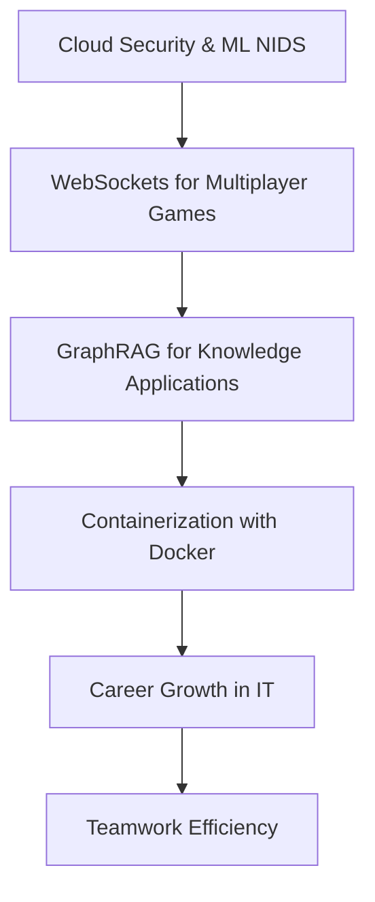

# First Cloud Journey (FCAJ) Technical Meetup

- **Event Name:** First Cloud Journey (FCAJ) Technical Meetup
- **Time:** 09:00 AM - 12:00 PM, Saturday, June 6, 2026
- **Location:** Bitexco Financial Tower, Ho Chi Minh City

## 1. Overview

### 1.1 Introduction

This report explores the intersection of cloud technologies, cybersecurity, and application development. It highlights how advanced tools and techniques are applied to build secure, scalable, and efficient systems.

### 1.2 Report Structure

## 2. Enhancing Cyber Attack Detection with AWS WAF and Machine Learning NIDS

### 2.1 AWS WAF: A First Line of Defense

AWS WAF protects websites, APIs, and applications from common web threats such as SQL injection, XSS, and malicious bot traffic. It integrates with CloudFront, ALB, and API Gateway, with support for custom rules, rate limiting, and monitoring.

### 2.2 Limitations of Traditional Rule-Based WAF

Rule-based systems are strong against known attacks but weak against zero-day threats, hybrid attacks, and unknown behavioral anomalies.

### 2.3 Introduction to Network Intrusion Detection Systems (NIDS)

A NIDS monitors network traffic, analyzes behavior, raises real-time alerts, and logs incidents for forensic analysis. It can integrate with firewalls and SIEM platforms.

### 2.4 Machine Learning for Advanced Threat Detection

ML-based NIDS can detect new attack patterns, process large traffic volumes, and adapt continuously to evolving threats.

### 2.5 Building and Training an ML-based NIDS

A practical workflow includes dataset selection, feature engineering, model training, and iterative evaluation. The CSE-CIC-IDS2018 dataset is a common benchmark.

### 2.6 Data Preprocessing for ML Models

Key steps include data merge and cleaning, handling missing/invalid values, class balancing, removing unnecessary columns, and validation.

### 2.7 System Architecture and AWS Deployment

Typical AWS components include VPC, EC2, ALB, WAF, S3, Kinesis Data Firehose, Lambda, Security Hub, GuardDuty, CloudWatch, and SNS.

### 2.8 Tools and Development Environment

VS Code, Jupyter Notebook, Python (scikit-learn, pandas, NumPy), GitHub, and AWS services are the core toolchain.

### 2.9 Results and Future Improvements

Achievements include improved model performance, better minority-class detection, and standardized cloud setup. Future work includes real-time data streams, GenAI with Amazon Bedrock, and automated incident response.

### 2.10 Lessons Learned

Data quality is critical for ML performance. Signature-based defense alone is insufficient. ML-based NIDS complements AWS WAF, while cloud-native deployment provides scalability and better manageability.

## 3. Connecting Godot Clients with AWS WebSockets for Multiplayer Games

### 3.1 Multiplayer Networking Fundamentals

Multiplayer systems require synchronized state sharing between players, often through server-authoritative architecture.

### 3.2 Choosing a Cloud Architecture

AWS provides scalable networking and compute primitives for real-time game backends.

### 3.3 API Gateway Route Key and DynamoDB Schema

Using route key `$request.body.action`, API Gateway can dispatch events dynamically. DynamoDB stores connection and match state fields such as `connectionId`, `status`, `opponentId`, `choice`, and `createdAt`.

### 3.4 Lambda Logic for Game State Management

Lambda handles matchmaking, state transitions, and game result calculation. It sends events like match found, waiting states, and final outcomes.

### 3.5 Godot Client: Establishing and Managing Connections

Godot uses `WebSocketPeer` and `connect_to_url()` for connection setup, with continuous polling for state updates.

### 3.6 Godot Client: Sending and Receiving Messages

Client requests are serialized JSON payloads. The UI reacts to server events like waiting, matched, result, or opponent disconnected.

### 3.7 Challenges and Lessons Learned

Common issues include stale connections, DynamoDB scan cost, and Lambda stateless constraints requiring persistent game state.

### 3.8 Future Considerations: AWS GameLift vs WebSocket + Lambda

WebSocket + Lambda suits serverless event patterns and fast prototyping. GameLift is stronger for managed matchmaking and dedicated game session orchestration.

## 4. Building GraphRAG Applications with Amazon Bedrock and Neptune

### 4.1 Introduction to Retrieval-Augmented Generation (RAG)

RAG combines retrieval and generation by injecting external knowledge at runtime to improve grounding and relevance.

### 4.2 Exploring GraphRAG

GraphRAG extends RAG with explicit entity relationships and multi-hop reasoning across connected knowledge.

### 4.3 Fully Managed Route with Amazon Bedrock and Neptune Analytics

Amazon Bedrock Knowledge Bases can handle chunking, extraction, and embeddings, while Neptune Analytics supports graph storage and relationship analysis.

### 4.4 Custom Route with LlamaIndex and Amazon Neptune

A custom pipeline allows full control of graph construction, Cypher querying, and retrieval strategy for advanced use cases.

## 5. Containerization with Docker

### 5.1 Virtualization vs Containerization

VMs package full operating systems; containers share the host kernel and are lighter, faster, and more portable.

### 5.2 Benefits of Containerization

- Easy portability across environments.
- Consistent runtime behavior.
- Lower compute overhead.

### 5.3 What is Docker?

Docker enables the build-once-run-anywhere workflow by packaging application dependencies into portable container images.

### 5.4 Docker Images and Dockerfiles

Dockerfiles define image layers. Cached layers speed up rebuilds and make CI/CD more efficient.

### 5.5 Docker Use Cases

Common scenarios include CI/CD pipelines, microservices, development/test parity, cloud-native apps, and legacy modernization.

## 6. Career Growth and Teamwork in IT

### 6.1 From IT Helpdesk to Senior System Administrator

Progression requires troubleshooting, communication, systems thinking, and hands-on infrastructure practice.

### 6.2 Life as a System Administrator

Core responsibilities include operations, networking, patching, monitoring, and capacity planning.

### 6.3 Transition to Cloud and DevOps

Key mindset shifts include IaC, automation, CI/CD, and close collaboration between dev and ops teams.

### 6.4 Interview Journey and Preparation

Strong practical projects, clear impact stories, and company-specific preparation are essential.

### 6.5 Lessons and Career Advice

Focus deeply on a few core skills first, build real projects, ask questions, and learn by doing.

### 6.6 The Art of Effective Teamwork

Collaboration tools like Trello, ClickUp, Google Workspace, Slack, and Discord improve communication and delivery quality.
