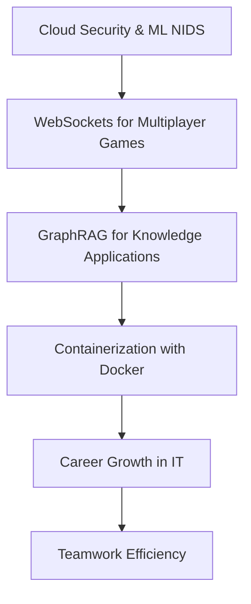

# First Cloud Journey (FCAJ) Technical Meetup

- **Tên sự kiện:** First Cloud Journey (FCAJ) Technical Meetup
- **Thời gian:** 09:00 AM - 12:00 PM, Thứ Bảy, ngày 06/06/2026
- **Địa điểm:** Bitexco Financial Tower, TP. Hồ Chí Minh

## 1. Tổng quan

### 1.1 Giới thiệu

Bản thu hoạch này tổng hợp các nội dung nổi bật về giao điểm giữa cloud, an ninh mạng và phát triển ứng dụng. Các chủ đề tập trung vào cách xây dựng hệ thống an toàn, hiệu quả và có khả năng mở rộng trên AWS.

### 1.2 Cấu trúc báo cáo

## 2. Tang cuong phat hien tan cong voi AWS WAF va ML-NIDS

### 2.1 AWS WAF: Lớp phòng thủ đầu tiên

AWS WAF bảo vệ website, API và ứng dụng khỏi các mối đe dọa phổ biến như SQL injection, XSS và bot traffic độc hại, đồng thời hỗ trợ rate limiting và tích hợp monitoring.

### 2.2 Hạn chế của WAF truyền thống

WAF dựa trên rule hoạt động tốt với mẫu tấn công đã biết nhưng khó phát hiện zero-day, spoofing và hành vi bất thường mới.

### 2.3 NIDS là gì

NIDS giám sát lưu lượng mạng, phân tích hành vi, cảnh báo theo thời gian thực và lưu log để điều tra sự cố.

### 2.4 Machine Learning cho phát hiện nâng cao

ML-NIDS học từ dữ liệu thực tế để phát hiện các mẫu tấn công mới và thích nghi theo thời gian.

### 2.5 Quy trình xây dựng ML-NIDS

Quy trình bao gồm chọn dataset, xử lý dữ liệu, huấn luyện mô hình, đánh giá và tối ưu. Bộ CSE-CIC-IDS2018 là nguồn dữ liệu tham khảo quan trọng.

### 2.6 Tiền xử lý dữ liệu

Các bước cốt lõi gồm làm sạch dữ liệu, xử lý missing/invalid values, cân bằng lớp, loại bỏ cột không cần thiết và kiểm tra chất lượng dữ liệu.

### 2.7 Kiến trúc hệ thống và triển khai AWS

Kiến trúc tham chiếu sử dụng VPC, EC2, ALB, WAF, S3, Kinesis Data Firehose, Lambda, Security Hub, GuardDuty, CloudWatch và SNS.

### 2.8 Công cụ phát triển

VS Code, Jupyter Notebook, Python (scikit-learn, pandas, NumPy), GitHub và hạ tầng AWS.

### 2.9 Kết quả và hướng cải tiến

Dự án cải thiện hiệu năng mô hình, xử lý tốt hơn bài toán mất cân bằng dữ liệu và chuẩn hóa hạ tầng cloud. Hướng tới tích hợp dữ liệu thời gian thực, GenAI với Bedrock và tự động phản ứng sự cố.

### 2.10 Bài học rút ra

Chất lượng dữ liệu quyết định hiệu quả mô hình. Bảo mật dựa chữ ký là chưa đủ. ML-NIDS bổ trợ tốt cho AWS WAF, còn triển khai cloud-native giúp mở rộng và vận hành hiệu quả hơn.

## 3. Ket noi Godot voi AWS WebSockets cho game multiplayer

### 3.1 Nền tảng networking multiplayer

Multiplayer cần đồng bộ trạng thái giữa nhiều người chơi trong cùng một phiên game.

### 3.2 Chọn kiến trúc cloud

AWS cung cấp các dịch vụ phù hợp cho game backend thời gian thực và khả năng mở rộng.

### 3.3 API Gateway route key và DynamoDB schema

Route key `$request.body.action` cho phép định tuyến động; DynamoDB lưu trạng thái kết nối và trận đấu.

### 3.4 Lambda xử lý game state

Lambda thực hiện matchmaking, cập nhật trạng thái và trả kết quả thắng/thua/hòa cho người chơi.

### 3.5 Godot client thiết lập kết nối

Godot dùng `WebSocketPeer` và `connect_to_url()` để mở kết nối và poll sự kiện liên tục.

### 3.6 Godot client gửi/nhận message

Dữ liệu được gửi dưới dạng JSON; client cập nhật UI theo các trạng thái từ server.

### 3.7 Thách thức thực tế

Các vấn đề điển hình gồm stale connection, chi phí scan DynamoDB và giới hạn stateless của Lambda.

### 3.8 Hướng mở rộng: GameLift hay WebSocket + Lambda

WebSocket + Lambda phù hợp prototype nhanh; GameLift mạnh ở quản lý session game và matchmaking chuyên dụng.

## 4. Xay dung GraphRAG voi Amazon Bedrock va Neptune

### 4.1 RAG là gì

RAG bổ sung tri thức ngoài vào prompt lúc runtime, giúp câu trả lời có căn cứ và giảm hallucination.

### 4.2 GraphRAG là gì

GraphRAG mô hình hóa tri thức theo đồ thị, hỗ trợ suy luận nhiều bước qua quan hệ giữa các thực thể.

### 4.3 Hướng managed với Bedrock và Neptune Analytics

Bedrock Knowledge Bases hỗ trợ pipeline trích xuất/embedding; Neptune Analytics đảm nhiệm lưu trữ và truy vấn quan hệ đồ thị.

### 4.4 Hướng custom với LlamaIndex và Neptune

Custom pipeline cho phép kiểm soát sâu quá trình dựng graph, truy vấn Cypher và tối ưu chiến lược truy hồi.

## 5. Containerization voi Docker

### 5.1 Virtualization vs Containerization

VM nặng hơn do mang theo cả OS; container nhẹ hơn vì chia sẻ kernel host.

### 5.2 Lợi ích container

- Dễ di chuyển giữa các môi trường.
- Chạy nhất quán nhờ đóng gói dependency.
- Tối ưu tài nguyên.

### 5.3 Docker là gì

Docker hiện thực hóa mô hình build once, run anywhere cho ứng dụng hiện đại.

### 5.4 Docker Image và Dockerfile

Dockerfile định nghĩa các layer image; cơ chế cache giúp tăng tốc quá trình build.

### 5.5 Use cases

CI/CD, microservices, dev/test parity, cloud-native apps, và hiện đại hóa hệ thống legacy.

## 6. Career Growth va Teamwork trong IT

### 6.1 Từ IT Helpdesk đến Senior SysAdmin

Lộ trình phát triển cần nền tảng troubleshooting, giao tiếp và tư duy hệ thống.

### 6.2 Công việc SysAdmin

Bao gồm quản trị hệ thống, mạng, patching, monitoring và capacity planning.

### 6.3 Chuyển dịch sang Cloud và DevOps

Trọng tâm là IaC, automation, CI/CD và cộng tác chặt giữa dev-ops.

### 6.4 Chuẩn bị phỏng vấn

Ưu tiên dự án thực tế, khả năng giải quyết sự cố và hiểu bối cảnh doanh nghiệp.

### 6.5 Bài học nghề nghiệp

Học sâu một số năng lực cốt lõi trước, làm dự án thực chiến, liên tục phản tư và cải tiến.

### 6.6 Nghệ thuật teamwork

Các công cụ như Trello, ClickUp, Google Workspace, Slack và Discord giúp tối ưu phối hợp nhóm.
