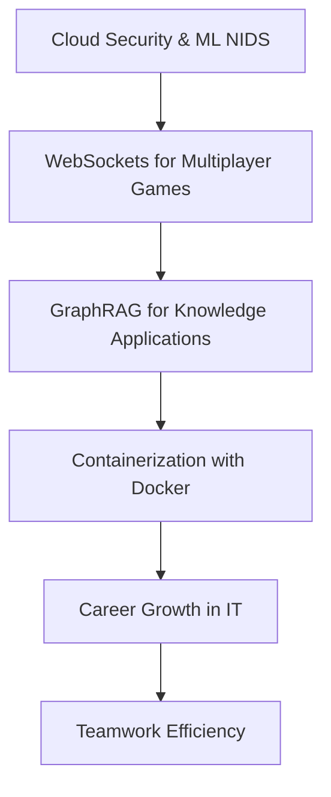

# First Cloud Journey (FCAJ) Technical Meetup

- **Tên sự kiện:** First Cloud Journey (FCAJ) Technical Meetup
- **Thời gian:** 09:00 AM - 12:00 PM, Thứ Bảy, ngày 06/06/2026
- **Địa điểm:** Bitexco Financial Tower, TP. Hồ Chí Minh

## 1. Tổng quan

### 1.1 Giới thiệu

Bản thu hoạch này tập trung vào giao điểm giữa công nghệ đám mây, an ninh mạng và phát triển ứng dụng hiện đại. Nội dung bao phủ từ phòng thủ ứng dụng với AWS WAF, phát hiện tấn công bằng học máy, cho tới hệ thống thời gian thực với WebSocket, GraphRAG, Docker và kỹ năng nghề nghiệp trong IT.

Mục tiêu của báo cáo là chuyển hóa kiến thức từ các phiên chia sẻ kỹ thuật thành góc nhìn triển khai thực tế: khi nào dùng dịch vụ nào, cách kết hợp các thành phần AWS để tạo ra hệ thống an toàn, linh hoạt và có khả năng vận hành ở quy mô lớn.

### 1.2 Cấu trúc báo cáo

## 2. Tăng cường phát hiện tấn công với AWS WAF và ML-NIDS

### 2.1 AWS WAF: Lớp phòng thủ đầu tiên

AWS WAF (Web Application Firewall) là lớp phòng thủ đầu tiên giúp bảo vệ website, API và ứng dụng khỏi các mối đe dọa phổ biến như SQL injection, cross-site scripting (XSS) và lưu lượng bot độc hại. Dịch vụ này tích hợp tốt với CloudFront, Application Load Balancer và API Gateway.

Ngoài ra, AWS WAF cho phép thiết lập rule để cho phép, chặn hoặc đếm request; đồng thời hỗ trợ rate limiting để giảm nguy cơ brute-force và scraping. Kết hợp với hệ sinh thái logging/monitoring, WAF giúp đội vận hành có cái nhìn rõ ràng hơn về bề mặt tấn công.

### 2.2 Hạn chế của WAF truyền thống

WAF truyền thống dựa trên các rule định nghĩa sẵn, vì vậy rất hiệu quả với mẫu tấn công đã biết. Tuy nhiên, phương pháp này khó bao phủ các hình thức tấn công mới như zero-day, spoofing lai tạp hoặc những hành vi bất thường chưa từng xuất hiện trong bộ chữ ký.

Điều đó cho thấy nhu cầu bổ sung một lớp phòng thủ thích ứng hơn, có khả năng học từ dữ liệu và phát hiện sai lệch hành vi theo thời gian thực.

### 2.3 NIDS là gì

NIDS (Network Intrusion Detection System) là hệ thống giám sát lưu lượng mạng nhằm phát hiện truy cập trái phép và dấu hiệu tấn công. Các chức năng cốt lõi gồm:

- Giám sát traffic liên tục.
- Phân tích hành vi theo signature hoặc anomaly.
- Cảnh báo thời gian thực.
- Ghi log để điều tra hậu sự cố.

NIDS cũng có thể tích hợp với firewall và SIEM để tăng mức độ quan sát và phản ứng sự cố.

### 2.4 Machine Learning cho phát hiện nâng cao

Machine Learning giúp NIDS vượt qua giới hạn của mô hình rule-based bằng cách học từ dữ liệu mạng thực tế. Khi được huấn luyện tốt, ML-NIDS có thể phát hiện các mẫu tấn công mới, xử lý khối lượng log lớn và liên tục thích nghi với chiến thuật tấn công thay đổi.

Đây là hướng phòng thủ chủ động, bổ trợ cho lớp phòng thủ phản ứng nhanh của AWS WAF.

### 2.5 Quy trình xây dựng ML-NIDS

Quy trình triển khai ML-NIDS gồm các bước chính:

- Chọn dataset phù hợp và có nhãn rõ ràng.
- Tiền xử lý, làm sạch và chuẩn hóa dữ liệu.
- Huấn luyện mô hình với tập train/validation.
- Đánh giá theo nhiều chỉ số (precision, recall, F1, confusion matrix).
- Tối ưu mô hình theo vòng lặp.

Trong báo cáo, bộ dữ liệu CSE-CIC-IDS2018 được xem là nguồn tham chiếu quan trọng vì có đa dạng loại tấn công và mức độ đại diện tốt.

### 2.6 Tiền xử lý dữ liệu

Tiền xử lý dữ liệu là giai đoạn quyết định chất lượng mô hình. Các bước trọng tâm bao gồm:

- Hợp nhất dữ liệu từ nhiều nguồn/bảng.
- Xử lý missing values, invalid rows và nhiễu.
- Cân bằng lớp để giảm thiên lệch về lớp thiểu số.
- Loại bỏ cột không hữu ích hoặc gây rò rỉ thông tin.
- Thực hiện data validation trước khi train.

### 2.7 Kiến trúc hệ thống và triển khai AWS

Kiến trúc triển khai trên AWS gồm nhiều lớp:

- **Mạng & compute:** VPC, EC2, ALB.
- **Lọc và bảo vệ đầu vào:** AWS WAF.
- **Lưu trữ dữ liệu:** Amazon S3.
- **Streaming và xử lý gần thời gian thực:** Kinesis Data Firehose, AWS Lambda.
- **Giám sát và bảo mật hợp nhất:** Security Hub, GuardDuty, CloudWatch, SNS.

Mô hình này giúp tách rõ các chức năng: thu thập - lọc - phân tích - cảnh báo, từ đó dễ mở rộng và vận hành.

### 2.8 Công cụ phát triển

Môi trường phát triển tiêu biểu:

- VS Code cho backend/frontend và quản lý mã nguồn.
- Jupyter Notebook cho phân tích dữ liệu, thử nghiệm và huấn luyện.
- Python cùng các thư viện scikit-learn, pandas, NumPy.
- GitHub cho version control và cộng tác.
- AWS cho hạ tầng triển khai, giám sát và bảo mật.

### 2.9 Kết quả và hướng cải tiến

Kết quả đạt được gồm tối ưu hiệu năng mô hình, cải thiện phát hiện lớp tấn công thiểu số và chuẩn hóa kiến trúc cloud. Đây là nền tảng tốt để mở rộng sang các kịch bản thực tế có lưu lượng lớn.

Trong tương lai, hướng nâng cấp gồm tích hợp luồng dữ liệu thời gian thực, bổ sung GenAI (Amazon Bedrock) để hỗ trợ phân tích ngữ cảnh sự cố, và tự động hóa hành động ứng phó.

### 2.10 Bài học rút ra

Các bài học cốt lõi:

- Chất lượng dữ liệu quyết định chất lượng mô hình.
- Bảo mật dựa trên chữ ký là chưa đủ trong môi trường tấn công biến đổi nhanh.
- ML-NIDS bổ trợ hiệu quả cho AWS WAF.
- Giám sát thời gian thực giúp tăng khả năng phát hiện sớm.
- Triển khai cloud-native giúp mở rộng tốt và dễ quản trị.

## 3. Kết nối Godot với AWS WebSockets cho game multiplayer

### 3.1 Nền tảng networking multiplayer

Multiplayer networking yêu cầu đồng bộ trạng thái giữa nhiều người chơi trong cùng một không gian trò chơi. Điều này thường cần một backend có khả năng quản lý kết nối, đồng bộ trạng thái và xử lý xung đột theo thời gian thực.

### 3.2 Chọn kiến trúc cloud

AWS cung cấp nền tảng phù hợp cho game backend nhờ khả năng mở rộng linh hoạt, độ sẵn sàng cao và hệ sinh thái dịch vụ event-driven. Việc thiết kế đúng kiến trúc cloud giúp hệ thống chịu tải tốt hơn khi số lượng người chơi tăng.

### 3.3 API Gateway route key và DynamoDB schema

Với API Gateway WebSocket, route key như `$request.body.action` cho phép định tuyến message theo nội dung request. DynamoDB được dùng để lưu trạng thái kết nối và trận đấu, ví dụ:

- `connectionId`
- `status` (waiting, matched)
- `opponentId`
- `choice`
- `createdAt`

### 3.4 Lambda xử lý game state

Lambda xử lý các sự kiện từ client để matchmaking, cập nhật trạng thái và tính kết quả thắng/thua/hòa. Luồng cơ bản gồm:

- Tìm người chơi đang chờ.
- Ghép cặp và gửi thông báo match found.
- Ghi lựa chọn của từng người chơi.
- So sánh kết quả và trả phản hồi cho cả hai bên.

### 3.5 Godot client thiết lập kết nối

Phía Godot, `WebSocketPeer` và `connect_to_url()` được dùng để mở kết nối đến backend. Sau khi kết nối, vòng lặp game poll liên tục để nhận sự kiện mới và cập nhật UI theo trạng thái phiên chơi.

### 3.6 Godot client gửi/nhận message

Message được gửi dưới dạng JSON. Client xử lý các trạng thái như `waiting_for_opponent`, `match_found`, `waiting_for_opponent_choice`, `result` (Win/Lose/Draw) để điều khiển trải nghiệm người chơi.

Trong trường hợp `opponent_disconnected`, hệ thống có thể tự động xử lý kết quả cho người chơi còn lại.

### 3.7 Thách thức thực tế

Một số thách thức thực tế bao gồm stale connection gây lỗi matchmaking, chi phí scan bảng DynamoDB khi dữ liệu tăng nhanh, và giới hạn stateless của Lambda buộc trạng thái game phải được lưu ngoài một cách nhất quán.

### 3.8 Hướng mở rộng: GameLift hay WebSocket + Lambda

WebSocket + Lambda phù hợp cho bài toán thời gian thực và triển khai nhanh theo mô hình serverless. Trong khi đó, GameLift mạnh về quản lý session và matchmaking chuyên dụng cho game quy mô lớn.

Việc lựa chọn phụ thuộc vào loại game, tần suất cập nhật trạng thái và chiến lược vận hành dài hạn.

## 4. Xây dựng GraphRAG với Amazon Bedrock và Neptune

### 4.1 RAG là gì

RAG (Retrieval-Augmented Generation) bổ sung ngữ cảnh ngoài vào prompt ở runtime để mô hình trả lời đúng trọng tâm hơn và giảm hallucination. Đây là hướng tiếp cận hiệu quả khi cần truy vấn tri thức chuyên miền hoặc dữ liệu cập nhật liên tục.

### 4.2 GraphRAG là gì

GraphRAG mở rộng RAG bằng cách biểu diễn tri thức dạng đồ thị, lưu rõ quan hệ giữa thực thể và tài liệu. Cách này hỗ trợ suy luận nhiều bước (multi-hop reasoning), đặc biệt hữu ích với câu hỏi phức tạp có chuỗi phụ thuộc dài.

### 4.3 Hướng managed với Bedrock và Neptune Analytics

Ở hướng fully-managed, Amazon Bedrock Knowledge Bases hỗ trợ pipeline chunking, trích xuất thực thể và tạo embedding. Amazon Neptune Analytics xử lý lưu trữ dữ liệu đồ thị và phân tích quan hệ, giúp giảm đáng kể công vận hành.

### 4.4 Hướng custom với LlamaIndex và Neptune

Ở hướng custom, có thể dùng LlamaIndex để tự kiểm soát pipeline xử lý dữ liệu và dựng knowledge graph. Amazon Neptune lưu graph và hỗ trợ truy vấn Cypher để thực hiện các truy vấn quan hệ linh hoạt theo yêu cầu nghiệp vụ.

## 5. Containerization với Docker

### 5.1 Virtualization vs Containerization

Virtualization chạy nhiều hệ điều hành đầy đủ trên cùng phần cứng nên tốn tài nguyên hơn. Containerization đóng gói ứng dụng cùng dependency trong đơn vị nhẹ, chia sẻ kernel host nên khởi động nhanh và tiết kiệm tài nguyên hơn VM.

### 5.2 Lợi ích container

- Dễ di chuyển giữa các môi trường.
- Chạy nhất quán nhờ đóng gói dependency.
- Tối ưu tài nguyên.

### 5.3 Docker là gì

Docker hiện thực hóa mô hình build once, run anywhere cho ứng dụng hiện đại.

### 5.4 Docker Image và Dockerfile

Dockerfile định nghĩa các layer image; cơ chế cache giúp tăng tốc quá trình build.

### 5.5 Use cases

CI/CD, microservices, dev/test parity, cloud-native apps, và hiện đại hóa hệ thống legacy.

## 6. Career Growth và Teamwork trong IT

### 6.1 Từ IT Helpdesk đến Senior SysAdmin

Lộ trình từ IT Helpdesk lên Senior System Administrator đòi hỏi năng lực troubleshooting dưới áp lực, giao tiếp tốt với người dùng và tư duy hệ thống bền vững. Điểm bứt phá thường đến từ việc tự học Linux, networking và thực hành lab liên tục.

### 6.2 Công việc SysAdmin

Công việc SysAdmin không chỉ xoay quanh server mà còn gồm quản trị mạng, vá bảo mật, theo dõi năng lực hệ thống và lập kế hoạch tài nguyên. Tự động hóa tác vụ lặp lại và tài liệu hóa cấu hình là hai thói quen then chốt.

### 6.3 Chuyển dịch sang Cloud và DevOps

Khi chuyển sang Cloud và DevOps, tư duy cần dịch chuyển từ vận hành thủ công sang IaC, automation, CI/CD và cộng tác chặt giữa đội phát triển - vận hành để tăng tốc phát hành nhưng vẫn giữ ổn định.

### 6.4 Chuẩn bị phỏng vấn

Trong hành trình phỏng vấn, dự án thực tế và khả năng xử lý sự cố thường tạo lợi thế lớn hơn việc chỉ học lý thuyết. Việc nghiên cứu bối cảnh doanh nghiệp trước phỏng vấn giúp trả lời sát nhu cầu thực hơn.

### 6.5 Bài học nghề nghiệp

Bài học nghề nghiệp quan trọng là học sâu một số năng lực cốt lõi trước, làm dự án thực chiến, dám hỏi và dám sai để tăng tốc phát triển. Một portfolio tốt thường thuyết phục hơn danh sách chứng chỉ.

### 6.6 Nghệ thuật teamwork

Teamwork hiệu quả là nền tảng để dự án đi xa. Các công cụ như Trello, ClickUp, Google Workspace, Slack và Discord giúp nhóm phối hợp mạch lạc hơn, nhưng yếu tố quyết định vẫn là tinh thần trách nhiệm và giao tiếp rõ ràng.
